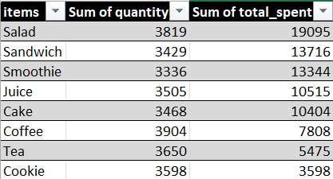
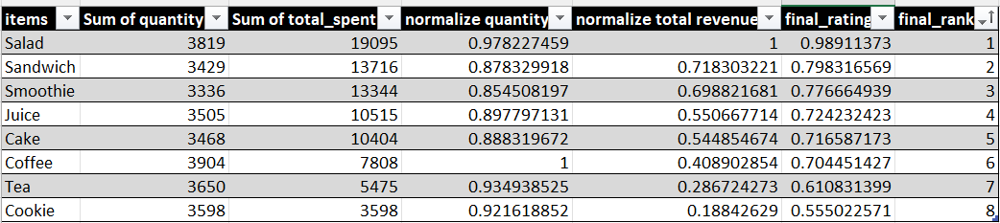
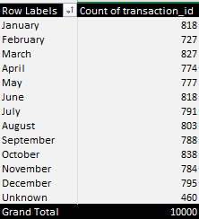
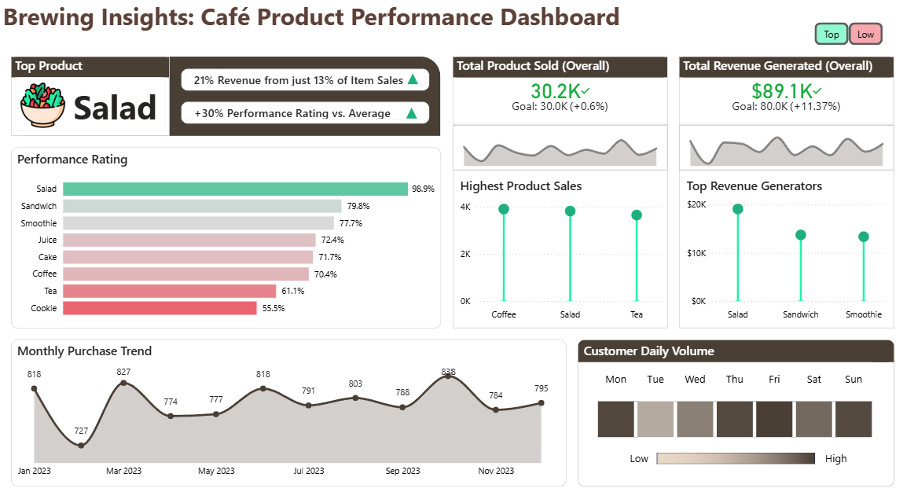
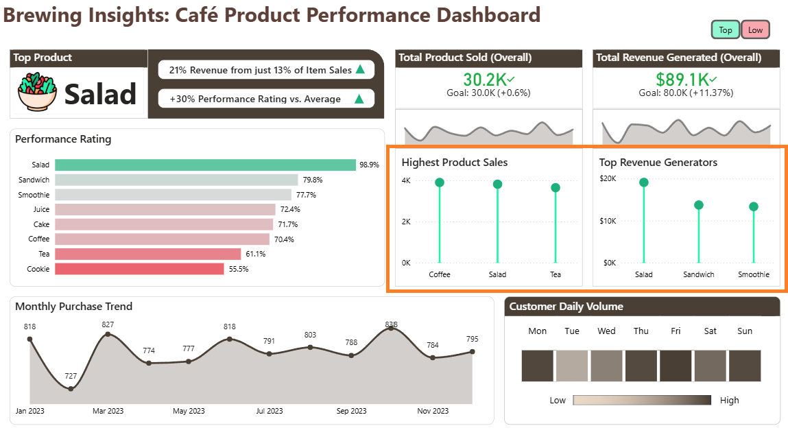
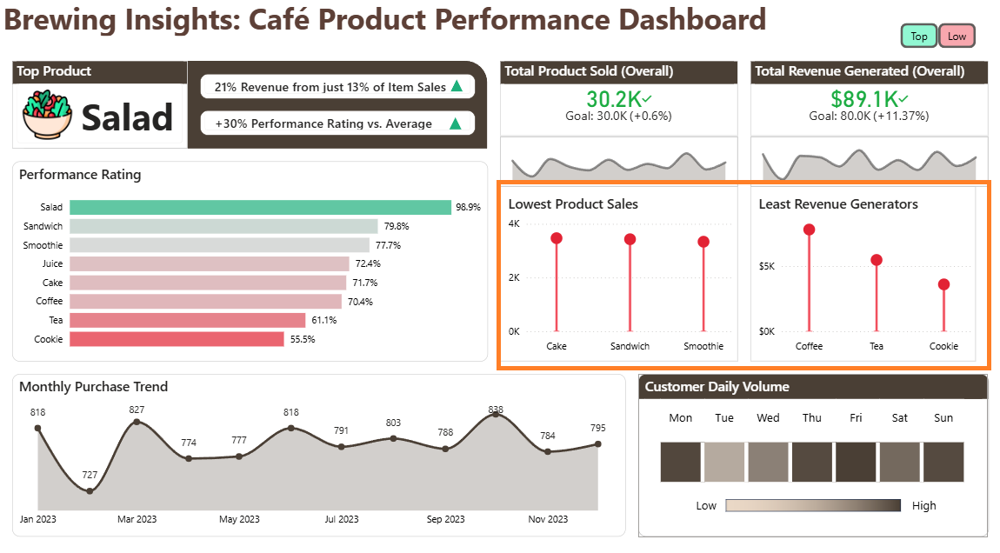
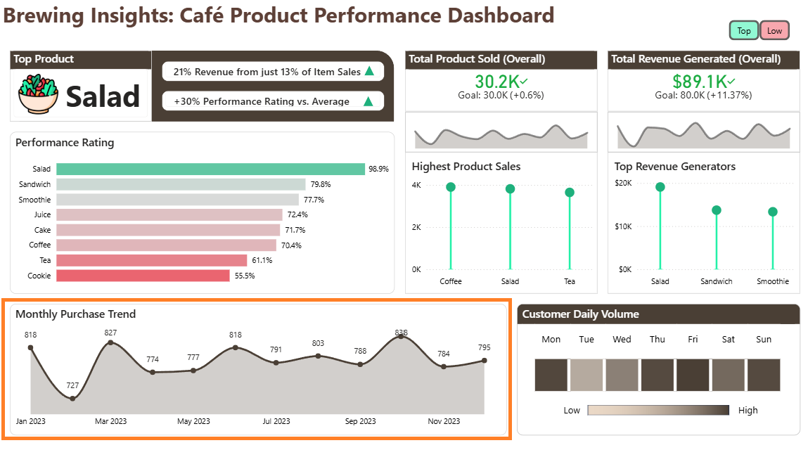
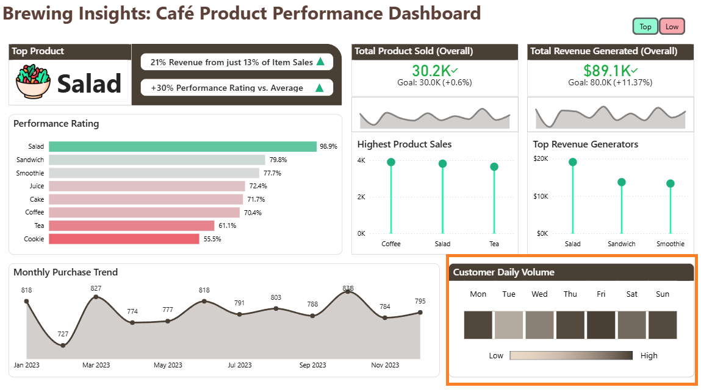

# ☕ Café X Product Performance Analysis  
*A Data Cleaning, Analysis and Visualization Project*  
**Prepared by:** Gio Noga  
**Date:** December 2025  

---

## 1. Objective

The goal of this project is to analyze Café X’s sales data to identify:

- The top-performing menu item in terms of quantity sold and revenue  
- Leading and Trailing menu items in terms of sales quantity and revenue generated    
- Sales trends over time
- Customer daily volume  

**Deliverables**

- Café Product Performance Dashboard  
- Insights that support better business decision-making  

---

## 2. Dataset Overview

**Source:** [Cafe Sales - Dirty Data for Cleaning Training](https://www.kaggle.com/datasets/ahmedmohamed2003/cafe-sales-dirty-data-for-cleaning-training)  
**Size:** 10,000 rows  

### Columns

| Column Name        | Description                                                  | Example       |
|--------------------|--------------------------------------------------------------|---------------|
| Transaction ID     | Unique identifier                                            | TXN_1234567   |
| Item               | Purchased item; may contain missing/invalid values           | Coffee        |
| Quantity           | Quantity purchased                                           | 1, 3, UNKNOWN |
| Price Per Unit     | Item's unit price                                            | 2.00, 4.00    |
| Total Spent        | Quantity × Price Per Unit                                    | 8.00, 12.00   |
| Payment Method     | May contain missing/invalid entries                          | Cash, Card    |
| Location           | Transaction location                                         | In-store      |
| Transaction Date   | May contain incorrect formatting                             | 2023-01-01    |

### Reference Price Table

| Item      | Price ($) |
|-----------|-----------|
| Coffee    | 2.00      |
| Tea       | 1.50      |
| Sandwich  | 4.00      |
| Salad     | 5.00      |
| Cake      | 3.00      |
| Cookie    | 1.00      |
| Smoothie  | 4.00      |
| Juice     | 3.00      |

---

## 3. Methodology

### 3.1 Data Validation

Before performing any cleaning operations, the dataset was reviewed to assess its overall quality and identify issues that required correction.  

A full walkthrough of the validation process is available here: **[Detailed Validation Steps](https://github.com/TauGI0/gn-data-cafe_product_performance_analysis/blob/main/cafe_sales_raw_validation.ipynb)**

Key findings include:

- Multiple columns contain missing or invalid values.  
- Missing-value indicators are not standardized (e.g., *Unknown*, *ERROR*, blank cells).  
- Several fields do not contribute to the project’s objectives and add unnecessary noise.  

These validation findings guided the subsequent data-cleaning procedures.

---

### 3.2 Data Cleaning

To prepare the dataset for accurate analysis, several cleaning steps were performed.

A full walkthrough of the cleaning process is available here: **[Detailed Cleaning Steps](https://github.com/TauGI0/gn-data-cafe_product_performance_analysis/blob/main/cafe_sales_raw_cleaning.ipynb)**

#### 3.2.1 Removing Unnecessary or Unusable Columns

Since the goal of this project is to analyze the performance of the café’s menu items, the columns **Payment Method** and **Location** were removed because:

- Each column contains more than **50% missing values**, making them unreliable for analysis.  
- These fields do not contribute meaningful insights toward item-level performance.  

#### 3.2.2 Handling Missing or Inaccurate Values

Two main strategies were applied to reconstruct missing or inconsistent values:

##### **Using Deterministic Relationships to Reconstruct Missing Values**

The columns **Quantity**, **Price per Unit**, and **Total Spent** share a deterministic (functional) mathematical relationship:

$$
Quantity \times Price\ per\ Unit = Total\ Spent
$$

Because these fields depend directly on one another, any missing value can be accurately reconstructed as long as the remaining two values are present. This method ensures precise, non-random imputation.

##### **Reference-Based Imputation**

When the **Item** value was available, missing prices were filled using the reference price table derived from consistent entries.

Additionally:

- If *Item* was missing but the **price was unique**, the correct item could be inferred.  
- If the price matched multiple items, the item was **not** imputed to avoid incorrect assumptions.  

#### 3.2.3 Standardizing Missing Indicators

To ensure consistent handling of missing data:

- Numeric and date fields containing *ERROR*, *UNKNOWN*, or blanks were replaced with **Null**.  
- String fields that could not be reliably imputed (e.g., ambiguous item names) were standardized to **"Unknown"**.

---

### 3.3 Data Analysis

To analyze the dataset, Excel pivot tables were used to aggregate values and uncover insights.

#### Top and Low Menu Items in Terms of Sales Quantity and Revenue Generated

The identification of top and low performing menu items was done by aggregating quantity sold and revenue.



#### Top Performing Product

The top-performing product for 2023 was determined by evaluating total quantity sold and total revenue generated.
Both metrics were normalized to ensure fair comparison, then averaged to produce a final performance rating for each product.

Normalization Formula:

$$
x' = \frac{x}{\max(x)}
$$



#### Monthly Transaction Frequency

To analyze monthly trends, a temporary column was created to extract the month name from each transaction date.
This allowed the number of transactions per month to be calculated and summarized easily using a pivot table.



#### Customer Volume per Day of Week

To identify peak customer days, a new calculated column was added to extract the day name from the `transaction_date` column.

```DAX
DayName =
    FORMAT ( 'cafe_sales_clean'[transaction_date], "ddd" )
```

The following measure calculates the distinct customer volume for the selected filters.

```DAX
Customer Volume =
    CALCULATE(
        DISTINCTCOUNT ( 'cafe_sales_clean'[transaction_id] ),
        ALLSELECTED ( 'cafe_sales_clean'[transaction_date] )
    )
``` 
---

### 3.4 Visualizations

A Power BI dashboard was created to visualize analysis results:

- **KPI Cards** → Top menu item, total items sold, total revenue
- **Bar Chart** → Product Performance Rating base on combined quantity solde and revenue
- **Lollipop Charts** → Top and Low Performers by quantity sold and revenue  
- **Line Chart** → Monthly transaction trend  
- **Matrix** → Heatmap for daily customer volume pattern  

---

## 4. Results



### 4.1 Top Performing Product

Analysis has shown that the best performing product for 2023 is Salad having a Performance Rating of **99%**


### 4.2 Top and Bottom Products in Terms of Quantity Sold and Revenue Generated

Analysis shows that in terms of quantity sold, **Coffee** takes the top followed closely by **Salad** and **Tea**. It is important to note that the gap between items does not vary grately with each contributing approximately **11–13%** to total sales.
However, in terms of revenue generated, **Salad** stands out as the top performer, likely due to its higher price point.
Meanwhile, **Cookies** contribute the least to overall revenue, making them the lowest-performing item in the sales mix.

**Top Performers**


**Underperformers**


### 4.3 Monthly Transaction Frequency

Monthly transaction volume averages around **800 transactions**, showing stable customer activity throughout the year. February records the lowest count, while October shows the highest, indicating only slight seasonal variation.  



### 4.4 Daily Customer Volume

Overall, analysis suggests strong customer presence at the start and end of the week, with a mid-week dip in activity.  



---

## 5. Conclusion and Recommendations

The 2023 analysis provides meaningful insight into how customers engage with the café’s menu and where the business creates real financial value. While high-volume, low-priced items such as Coffee, Tea, and Cookies generate steady foot traffic, they do not significantly lift revenue on their own. Their value lies in driving customer visits, enabling opportunities to convert purchases toward more profitable offerings.

Premium items like Salad, Sandwich, and Smoothie, demonstrate strong revenue efficiency, indicating that customers who choose these items contribute disproportionately to overall profitability. This suggests that the café’s growth potential does not depend on increasing transaction count, which is already stable at about 800 per month, but rather on shifting purchasing behavior toward higher-margin items.

Mid-performing items like Cake and Juice help maintain product variety and support a balanced menu without negatively influencing margins.

The overall pattern of monthly transactions signals a healthy and predictable customer base, giving the café a solid foundation for strategic menu and pricing adjustments.

Together, these insights point to a key takeaway: **The café can improve its financial performance not by expanding volume, but by optimizing the value extracted from each visit.**


### Recommendations

#### 1. Promote High-Revenue Items
- Highlight Salad, Sandwich, and Smoothie more clearly on the menu.  
- Use simple upsell prompts like “Upgrade to a Smoothie for +₱X.”  
- Try seasonal or limited-time versions to attract more interest.
- Encourage staff to suggest premium items when appropriate. 

#### 2. Adjust Coffee Pricing
- Consider a small price increase (5–10%) to help boost revenue.  
- Offer premium options such as flavored syrups or larger sizes to create higher-value choices.

#### 3. Improve Performance of Cookie and Tea
- Create bundles like “Coffee + Cookie” or “Sandwich + Tea” to increase sales.  
- Promote them as add-ons (e.g., “Add a cookie for only ₱X”).  
- Introduce new or seasonal variants to make them more appealing.

#### 4. Maintain Mid-Tier Items
- Keep Cake and Juice at their current prices and placement since they perform steadily.  
- Review their performance regularly to ensure they remain consistent.

---


